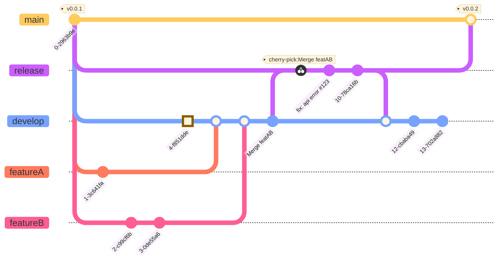

## Introduction
GitFlow is an abstract idea for managing branches using Git. It helps how branches should be created, and how to merge them. On windows, the base installation of Git comes with the command git-flow, which allows determining the flow in the repository. His only difference to git init is that he creates and delimits names for specific branches. On OSX systems, it can be installed via brew, with the brew install git-flow command.

Our team was in need to start defining some git branches patterns. I brought the idea to the table to implement the git-flow process. The people on our teams was increasing, so we would need more coordination in working together with many developers on the same project.

We should work together to implement for future process automation.

## How does it work?
I am going to explain each part of the process. Explaining how all the parts fit together. Just to a point to consider here, this pattern, it's just a conventional, you might find a better way to your team, so, you can break the rules!

## Main and Develop branches
The combination of the two branches allows you to maintain a version history. The main is the production branch, and where version tags are launched. Develop is a branch of integration with features, it is created from main, and all the next features are merged into it.

## Feature Branches
A feature branch is created from the last develop, and when it is finished, it is merged back into the develop and deleted. Feature branches never interact directly with the main.

## Release Branches
When develop branch is ready to go for approval, a release branch is created from it. In the release branch created, bug fixes, documentation, improvements, any requests in tests performed by QA are carried out. After finalized and tested, it is merged with main and develop, creating a new version tag on main and then deleted.

## Hotfix Branches
The hotfix branch is for solving errors occurred in production, it is created directly from the main, as soon as it is solved, it is merged into main and develop (or release if it is still active). Also adding a new version tag to main.

## Recap
The general git-flow follows below:

* develop branch is created from the main;
* release branch is created from develop;
* feature branches are created from develop;
* When a release is completed, it is merged with develop;
* When the release is complete, it is merged with develop and main
* If a problem in the main is detected, a branch called hotfix is created from the main;
* Once the hotfix is completed, it is merged with develop and main